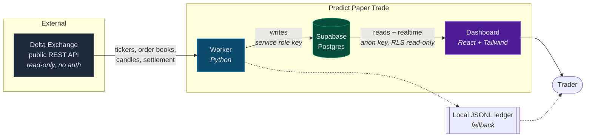
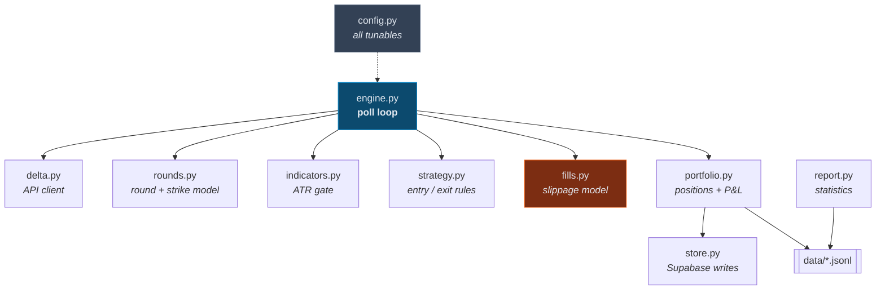
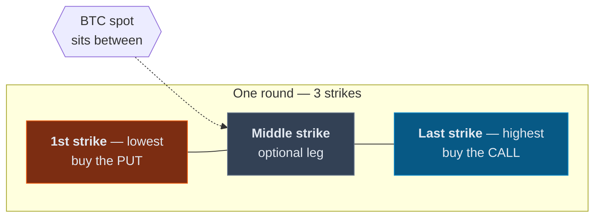
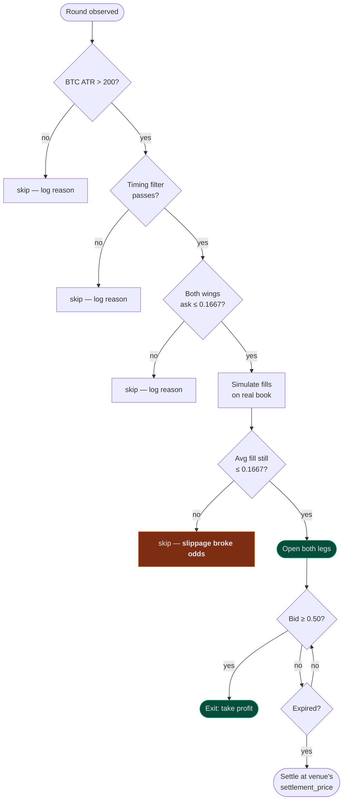
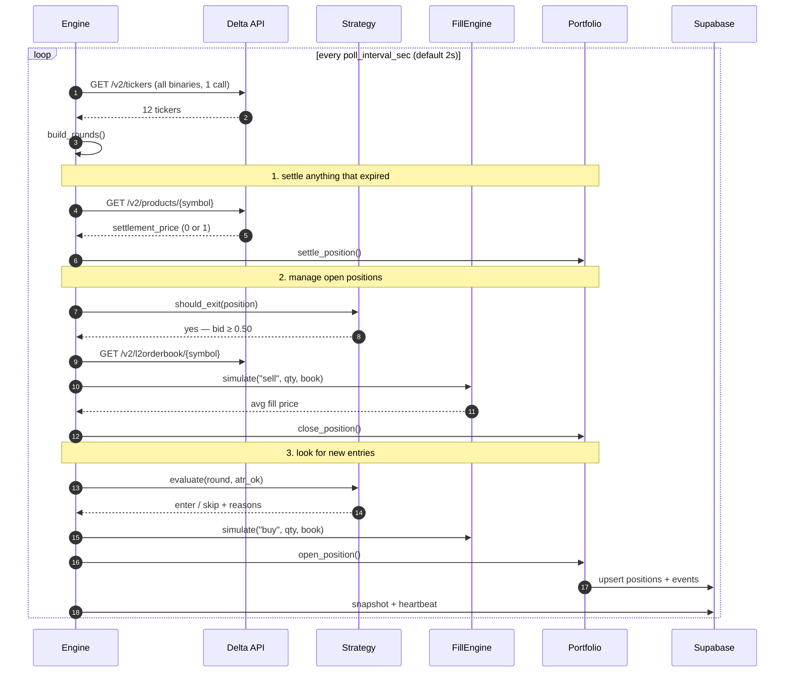
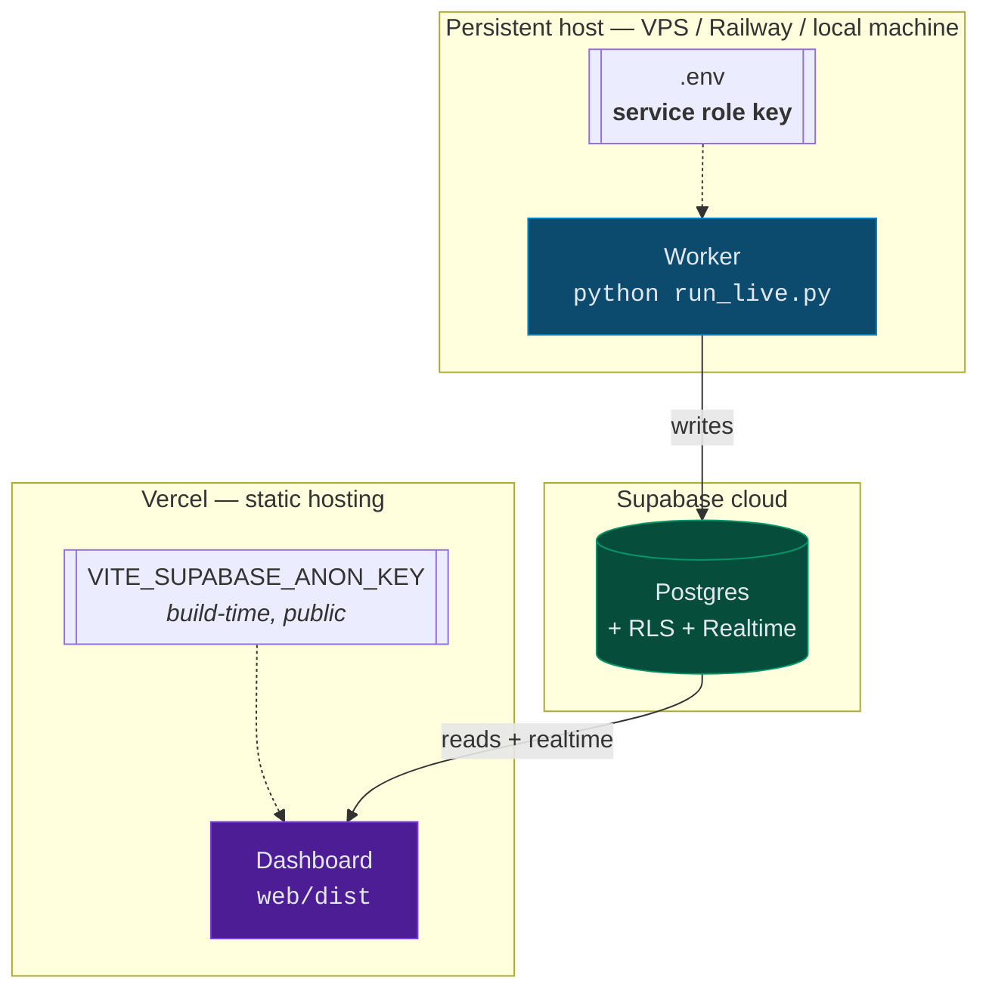

# High Level Design — Predict Paper Trade

> Paper-trading system for Delta Exchange **Predict** markets (BTC/ETH binary options).
> Runs a strategy against live market data and reports what it *would* have made,
> without risking capital.

**Audience:** anyone picking up the project — engineers, reviewers, or the desk.
For implementation detail see [LLD.md](./LLD.md).

---

## 1. Why this exists

Delta Exchange launched **Predict**, a market of short-dated binary options on BTC
and ETH. A strategy was proposed for it (see §6). Two problems blocked evaluating it:

| Problem | Consequence |
|---|---|
| Delta serves **no historical order books** for these contracts | A conventional backtest is impossible |
| The contracts are **thin at exactly the strikes the strategy buys** | Naive simulation invents profit that does not exist |

So the only honest way to evaluate the strategy is **forward paper trading against
live data, with realistic fills**. That is what this system is.

### Non-goals

- It does **not** place real orders. It never authenticates with Delta.
- It does **not** predict price or optimise parameters.
- It does **not** claim the strategy is profitable. It is the instrument for finding out.

---

## 2. System context

**Trust boundary:** the worker holds the only credential that can write (the Supabase
service role key). The browser holds an anon key that RLS restricts to `SELECT`.
Nothing in the system can move money.

---

## 3. Components

| Component | Tech | Responsibility | Lives |
|---|---|---|---|
| **Worker** | Python 3.12 | Poll market, apply rules, simulate fills, keep the book of record | Any persistent host |
| **Database** | Supabase (Postgres) | Durable store for runs, positions, events, snapshots | Supabase cloud |
| **Dashboard** | React 18 + Tailwind 4 + Vite 8 | Render live state and results | Vercel (static) |
| **Local ledger** | JSONL files | Fallback + offline record | Worker's disk |

### Worker internals

`fills.py` is highlighted because it is the component that decides whether any
result is believable — see §5.

---

## 4. The market, as verified

Everything below was confirmed against the live API, not assumed from docs.

| Property | Value |
|---|---|
| Host | `api.delta.exchange` (**global** only — binaries are absent from the India host) |
| Symbol format | `B-C-BTC-<strike>-<DDMMYYHHMM>` (call), `B-P-...` (put) |
| Contract types | `binary_call_options`, `binary_put_options` |
| Round cadence | A new round every **15 minutes** |
| Listing lead time | Lists **~20 min before expiry** → ~2 rounds live at once |
| Strikes per round | Exactly **3** (BTC spaced 100, ETH spaced 5) |
| Instruments per round | 6 (3 strikes × call/put) |
| Price range | 0.0001 – 0.9999, tick 0.0001 |
| Payout | **1.0 USDT if ITM**, else 0.0 |
| Commission | **0** maker and taker |
| Settlement | Expired products publish `settlement_price` (0 or 1) |
| Order types | **Market only.** `limit_order_not_allowed_for_binary_options` and `stop_orders_not_allowed_for_binary_options` are documented rejections, so there is no maker path |

Because there are exactly three strikes, the strategy's *"1st / middle / last strike"*
maps onto them without ambiguity:

Buying both wings is a **long strangle**: cheap while spot sits in the middle, and
it pays if BTC moves far enough either way before expiry.

---

## 5. The central design problem: slippage

The strategy buys the cheapest contracts in the book. Those are exactly where
liquidity is thinnest. Measured live during development:

| Order size | Avg fill | vs touch (0.0320) | Levels consumed |
|---:|---:|---:|---:|
| 30 | 0.0320 | — | 1 |
| 100 | 0.0419 | **+31%** | 3 |
| 500 | 0.1307 | **+308%** | 10 |

> At 500 contracts you pay **4× the touch price**, turning a 1:5 bet into roughly
> 1:6.6 before the market has moved at all.

**Size, not direction, is the dominant risk on these markets.**

A paper-trading system that fills at mid or at mark — as most do — would report
edge that evaporates in production. So the design makes realistic fills the
default and the optimistic ones opt-in:

| Mitigation | Where |
|---|---|
| Walk real L2 depth level by level | `fills.walk_book` |
| **Re-test the odds rule against the price actually paid**, not the touch | `engine.try_enter` |
| Refetch the book at execution time so real latency is in the fill | `fills.refetch_book_on_execute` |
| Reject rather than silently under-fill when depth is short | `allow_partial: false` |
| Skip legs whose spread exceeds a fraction of mid | `fills.max_spread_frac` |
| Track slippage cost as a first-class metric | `Position.entry_slippage` |

`fills.model` can be switched to `best_quote` or `mark` deliberately, to measure
how much of any apparent edge is a fill-model artifact.
**If a strategy only works under `mark`, it does not work.**

---

## 6. Strategy, and its ambiguities

The strategy as originally stated:

> Give a filter for timings · entry in 1st and last strike, atleast 1:5 odds on both ·
> Middle strike entry only if entry has 1:3 odds · exit rule ITM 50 ·
> only when BTC ATR is more than 200 · be careful about slippages

Three parts admit more than one reading. Rather than bake in a guess, each is a
**config flag**, with the default chosen for a stated reason:

| Ambiguity | Flag | Default | Why that default |
|---|---|---|---|
| What "1:5 odds" means | `entry.odds_convention` | `risk_reward` → max **0.1667** | Standard odds convention (risk 1 to win 5). Alternative `payout_multiple` → 0.20 |
| What "ITM 50" means | `exit.mode` | `price` → close at **0.50** | The alternative ("spot 50 past strike") fires almost instantly at ATR > 200 and stops doing any work |
| Which legs | `entry.require_both_wings` | `true` | "1:5 odds on **both**" implies all-or-nothing |

The middle-strike leg is **off** by default, so the wings can be measured alone
before deciding what it adds.

### Decision flow per round

Every skip is logged **with its reason**. A filtered strategy does nothing most of
the time, and a silent system is indistinguishable from a broken one.

---

## 7. Runtime flow

**One bulk ticker call per poll** covers every live instrument. Order books are
fetched only for legs actually being acted on, which keeps request volume low.

---

## 8. Deployment

> ### ⚠️ The worker cannot run on Vercel
> It is a long-running poller. Serverless functions are killed after seconds.
> **Vercel hosts the dashboard only.** With no worker running, the dashboard
> connects successfully and displays nothing, because nothing is writing.

| Concern | Position |
|---|---|
| Anon key is in the client bundle | Expected. RLS makes it read-only. But **anyone with the URL can read your trade history** — use Vercel Deployment Protection if that matters |
| Service role key | Worker environment only. Never in Vercel, never prefixed `VITE_` |
| Supabase unreachable | Worker keeps trading and keeps writing JSONL; only the dashboard goes stale |
| Worker crashes | Poll errors are caught per-iteration; the loop survives. Open positions are in memory and are **lost on restart** (see §10) |

---

## 9. Design decisions

| Decision | Alternative | Why |
|---|---|---|
| REST polling at 2s | WebSocket streaming | Rounds last 20 min and entries are not latency-sensitive. Polling is far simpler and more robust to reconnects |
| Order-book walk as default fill model | Mid/mark fill | Mid fills manufacture edge on exactly these thin books (§5) |
| Settlement read from venue | Inferred from spot vs strike | `settlement_price` is authoritative; inference would drift at the boundary |
| Python worker + JS dashboard | One language | Strategy logic is clearest in Python; live UI is clearest in React. Supabase is the clean seam |
| Supabase | Self-hosted Postgres / SQLite | Gives Postgres + RLS + realtime + hosting in one, with no backend to write |
| PostgREST via `requests` | `supabase-py` client | One HTTP dependency, no client-library version drift |
| Config flags for ambiguous rules | Pick one reading | The readings are genuinely undecided; flags let data settle it instead of argument |
| Best-effort persistence | Fail-fast on DB error | A database outage must never stop or corrupt a trading run |

---

## 10. Known limitations

| Limitation | Impact | Mitigation |
|---|---|---|
| **No historical backtest possible** | Results only accumulate forward | Inherent to the venue; run it longer |
| Open positions held in memory | Restart loses them; they settle in the DB as stale `open` | Acceptable for 20-min contracts; would need rehydration from DB to fix |
| Market impact not modelled | Fills assume your order doesn't move the book | Reasonable ≤100 contracts, not at 1000 |
| Queue position not modelled | Every fill treated as taker | Conservative — taker is the worse case |
| Fees hardcoded to 0 | Wrong if Delta introduces binary commissions | `portfolio.taker_fee_rate` is configurable |
| Single underlying per run | BTC or ETH, not both | Run two workers with different `run_name` |

---

## 11. Verification status

Confirmed against the live venue, not mocked:

| Path | Evidence |
|---|---|
| Market data + round parsing | 12 live tickers, strikes/expiry parsed correctly |
| ATR gate | `ATR(14, 5m) = 160.4 → gate CLOSED` — correctly blocked entries |
| Order-book fills | 30/100/500 contract walks produced the §5 table |
| Entry | `B-C-BTC-76000` filled 20 @ 0.0310 |
| Take-profit exit | `B-P-BTC-75400` 0.5700 → 0.5360, *"bid 0.5090 >= 0.50"* |
| Expiry settlement | `B-C-BTC-76000` 0.0310 → 0.0000, *"settled OTM"* |
| Reporting | Per-round and per-leg statistics produced |
| Dashboard | Renders on desktop and mobile; all requests 200 |

> **No performance claim is made.** Those runs used a deliberately loosened config
> to force signals and exercise code paths. They prove the machinery works, not
> that the strategy earns.

---

## 12. Reading results correctly

On a strangle, **one wing is meant to expire worthless**. A leg-level win rate
near 25–33% is normal and is not a failure signal.

From an actual verification run:

| Metric | Value |
|---|---|
| Leg win rate | 33.3% |
| **Round win rate** | **50.0%** |

Judging this strategy on leg win rate would badly misread it. Both the dashboard
and the CLI report round-level and leg-level statistics **separately** for this reason.
