# Low Level Design — Predict Paper Trade

> Module-by-module implementation reference: data structures, algorithms, schema,
> and control flow. For system context and rationale see [HLD.md](./HLD.md).

---

## Table of contents

1. [Module map](#1-module-map)
2. [Domain model](#2-domain-model)
3. [`delta.py` — API client](#3-deltapy--api-client)
4. [`rounds.py` — round and strike model](#4-roundspy--round-and-strike-model)
5. [`indicators.py` — ATR](#5-indicatorspy--atr)
6. [`fills.py` — slippage model](#6-fillspy--slippage-model)
7. [`strategy.py` — rule engine](#7-strategypy--rule-engine)
8. [`portfolio.py` — positions and P&L](#8-portfoliopy--positions-and-pl)
9. [`store.py` — Supabase persistence](#9-storepy--supabase-persistence)
10. [`engine.py` — poll loop](#10-enginepy--poll-loop)
11. [`report.py` — statistics](#11-reportpy--statistics)
12. [Database schema](#12-database-schema)
13. [Frontend](#13-frontend)
14. [Configuration reference](#14-configuration-reference)
15. [Error handling](#15-error-handling)
16. [Extension points](#16-extension-points)

---

## 1. Module map

| Module | LoC | Depends on | Pure? |
|---|---:|---|---|
| `config.py` | ~180 | `yaml` | ✅ |
| `delta.py` | ~110 | `requests` | ❌ network |
| `indicators.py` | ~90 | `delta` | ❌ network |
| `rounds.py` | ~180 | — | ✅ |
| `fills.py` | ~140 | `config` | ✅ |
| `strategy.py` | ~180 | `rounds` | ✅ |
| `portfolio.py` | ~200 | `store` | ❌ disk |
| `store.py` | ~200 | `requests` | ❌ network |
| `engine.py` | ~280 | all | ❌ |
| `report.py` | ~180 | — | ✅ |

The pure modules (`rounds`, `fills`, `strategy`, `report`, `config`) hold all the
decision logic and are testable without network or disk.

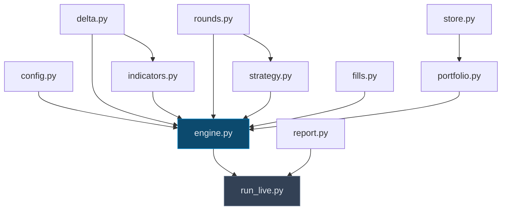

---

## 2. Domain model

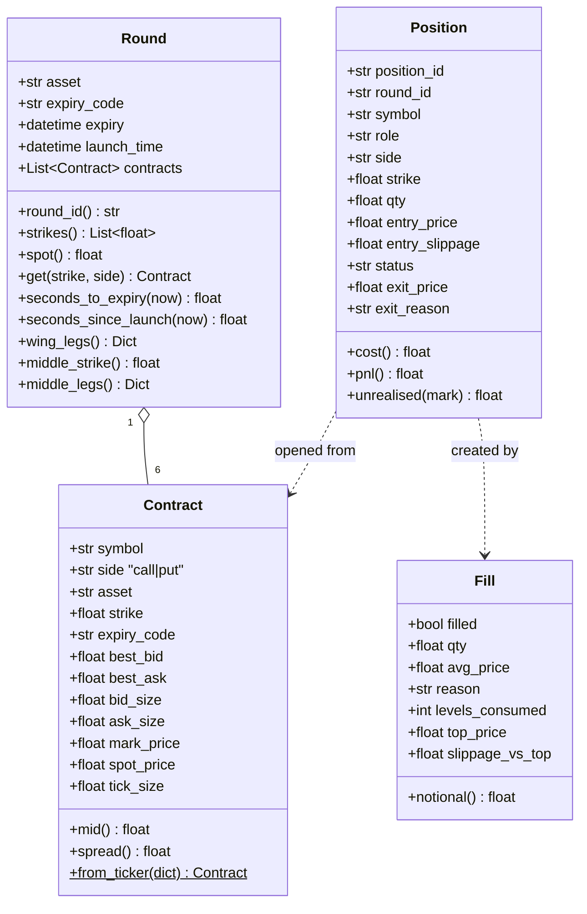

### Symbol grammar

```
B - C - BTC - 75600 - 1609261915
│   │    │      │         │
│   │    │      │         └── expiry DDMMYYHHMM → 16 Sep 2026 19:15 UTC
│   │    │      └──────────── strike
│   │    └─────────────────── underlying
│   └──────────────────────── C = call, P = put
└──────────────────────────── B = binary
```

Parsed by `SYMBOL_RE`:

```python
r"^B-(?P<side>[CP])-(?P<asset>[A-Z0-9]+)-(?P<strike>[0-9.]+)-(?P<expiry>\d{10})$"
```

> **Note:** the Predict UI shows a *combined* market id like `B-BTC-75600-1609260115`
> with no `C`/`P` segment. That is a UI construct, not a tradable symbol. The API
> always exposes the call and put separately.

---

## 3. `delta.py` — API client

Read-only. No authentication, no order placement.

| Method | Endpoint | Used for |
|---|---|---|
| `live_binary_products()` | `GET /v2/products?contract_types=…&states=live` | `launch_time` (absent from tickers) |
| `binary_tickers()` | `GET /v2/tickers?contract_types=…` | **Main poll** — all instruments in one call |
| `orderbook(symbol)` | `GET /v2/l2orderbook/{symbol}` | Fill simulation |
| `candles(sym, res, start, end)` | `GET /v2/history/candles` | ATR input |
| `product_by_symbol(symbol)` | `GET /v2/products/{symbol}` | Post-expiry lookup |
| `settlement_price(symbol)` | ↑ | Authoritative settlement (0 or 1) |

### Retry behaviour

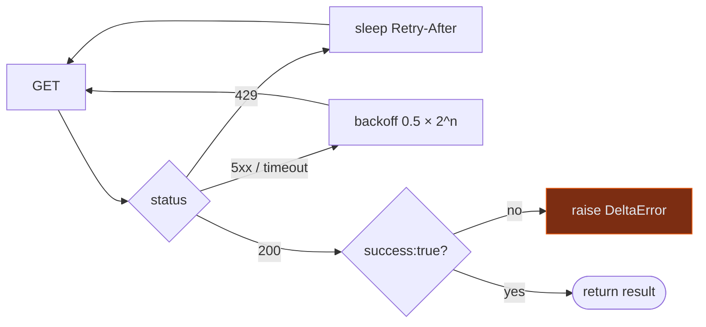

`settlement_price()` returns `None` while `state == "live"`, so a position is never
settled early.

### Candle symbol — a trap

| Symbol | Behaviour |
|---|---|
| `BTCUSDT` | ✅ Live, tracks spot |
| `BTCUSD` | ❌ **Stale and flat** — ATR computes to 0.0 |
| `MARK:BTCUSDT` | Works, different values (mark, not spot) |
| `.DEBTCUSDT` | Returns empty |

Using `BTCUSD` yields `ATR = 0`, which fails `> 200` forever and silently disables
trading. `config.yaml` carries a warning comment on this field.

---

## 4. `rounds.py` — round and strike model

### `build_rounds(tickers, asset, products) -> List[Round]`

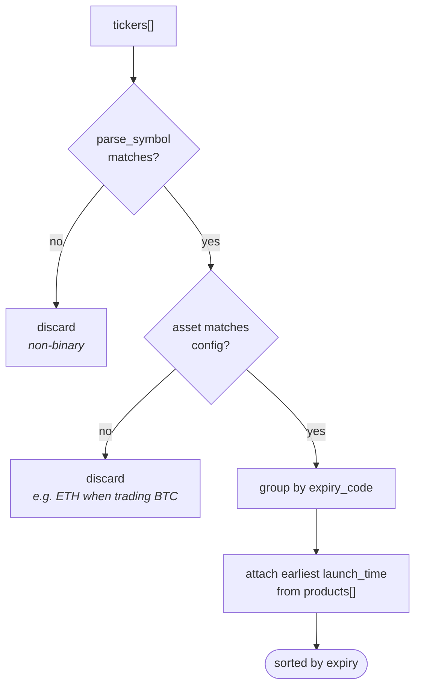

`launch_time` comes from `/v2/products` because tickers omit it. Products are
refreshed at most once every 60s (`Engine._refresh_products`).

### Strike role assignment

```python
def wing_legs(self):
    strikes = self.strikes            # sorted ascending
    return {"low":  self.get(strikes[0],  "put"),
            "high": self.get(strikes[-1], "call")}
```

| Role | Strike | Side | Rationale |
|---|---|---|---|
| `wing_low` | lowest | **put** | OTM while spot sits above → cheap |
| `wing_high` | highest | **call** | OTM while spot sits below → cheap |
| `middle` | middle | cheaper of call/put | Near ATM, priced ~0.50 |

Choosing put-low and call-high is what makes both legs cheap simultaneously — a
long strangle. Taking the *call* at the low strike would be deep ITM and priced
near 1.0, which can never satisfy a 1:5 odds test.

---

## 5. `indicators.py` — ATR

**Wilder's smoothed ATR**, the definition charting tools use.

```
TR_i  = max(high_i − low_i, |high_i − close_{i−1}|, |low_i − close_{i−1}|)

ATR_p = mean(TR_1 … TR_p)                          seed
ATR_i = (ATR_{i−1} × (p − 1) + TR_i) / p           smoothing
```

> Wilder's smoothing differs materially from a simple mean. Measured on the same
> window: **simple = 258.6**, **Wilder = 170.3**. Only one of those clears a 200
> threshold, so the choice is not cosmetic. Wilder is used because that is what
> "ATR" conventionally means.

### `AtrGate`

| Field | Default | Purpose |
|---|---|---|
| `refresh_sec` | 30 | Cache TTL — the poll loop runs every 2s, ATR need not |
| `period` | 14 | Wilder period |
| `min_atr` | 200 | The gate |
| `enabled` | true | Set false to bypass (testing only) |

Requests `period × 6 + 20` bars so smoothing is fully warmed up. On fetch failure
it returns the **last cached value** rather than `None`, so a transient outage does
not flip the gate shut mid-round.

`passes()` returns `(bool, Optional[float])` — the value is returned even when the
gate fails, so the dashboard can render "182.4, below 200".

---

## 6. `fills.py` — slippage model

The most consequential module. See [HLD §5](./HLD.md#5-the-central-design-problem-slippage).

### `walk_book(book, side, qty, max_levels, allow_partial) -> Fill`

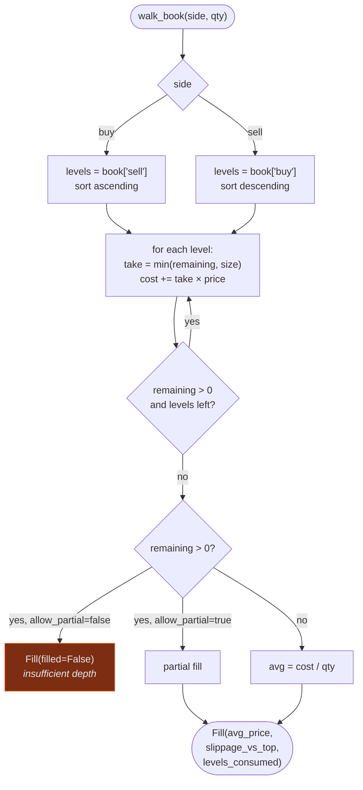

Levels are re-sorted defensively rather than trusting feed ordering.

### Fill models

| `fills.model` | Fill price | Honest? |
|---|---|---|
| `orderbook` *(default)* | Volume-weighted walk of real depth | ✅ |
| `best_quote` | Touch price, unlimited size | ⚠️ optimistic |
| `mark` | Mark price — ignores the spread entirely | ❌ diagnostic only |

The non-default models exist to **measure how much apparent edge is a fill-model
artifact**, not for production runs.

### Derived fields

| Field | Meaning |
|---|---|
| `top_price` | Touch price — what a naive simulator would use |
| `slippage_vs_top` | `avg − top` (buy) or `top − avg` (sell). Always ≥ 0 |
| `levels_consumed` | Depth eaten. `1` means the order fit on the touch |

`slippage_vs_top × qty` is summed into the dashboard's **Slippage cost** KPI.

### `spread_ok(bid, ask)`

Rejects a leg when `(ask − bid) / mid > max_spread_frac` (default `1.5`). Guards
against quotes like `bid 0.001 / ask 0.049`, where mid is meaningless and any fill
is a coin flip on the maker's mood.

---

## 7. `strategy.py` — rule engine

Pure functions over a `Round`. No I/O, fully testable.

### `evaluate(round, now, atr_ok, atr) -> RoundDecision`

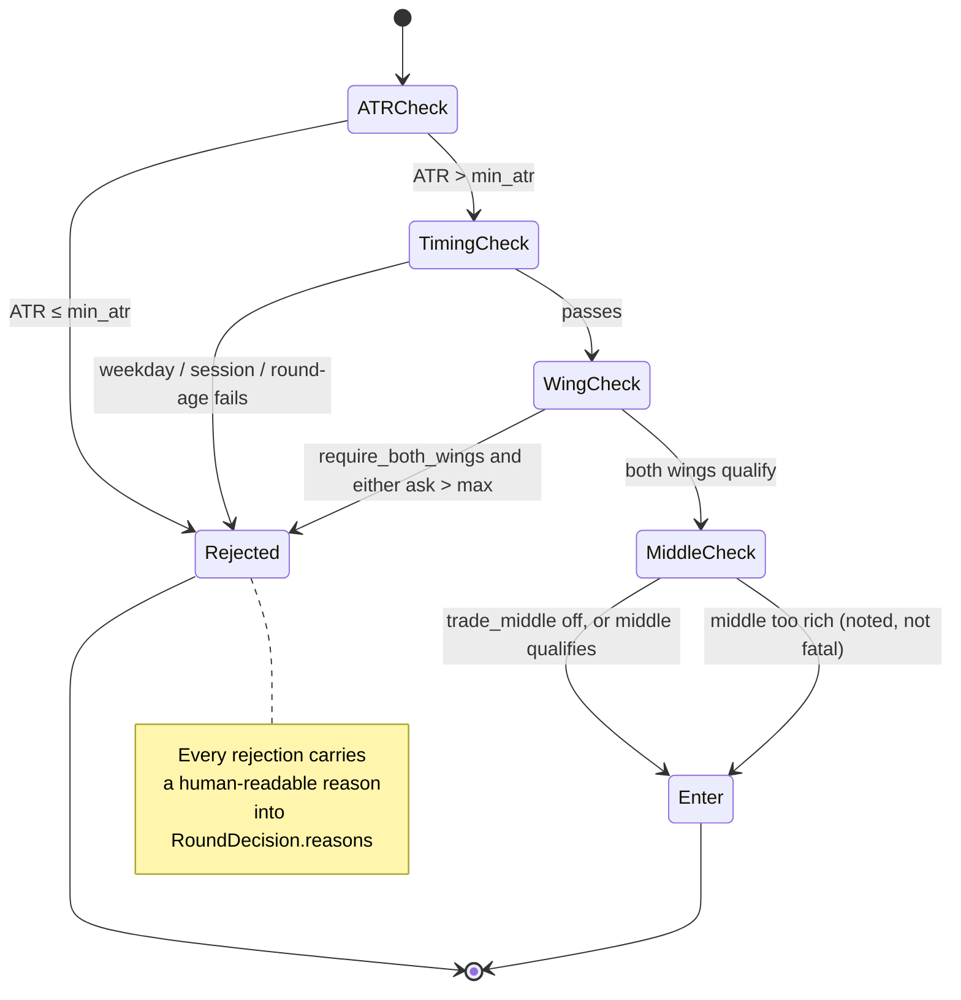

### Timing filter — two independent axes

| Axis | Fields | Purpose |
|---|---|---|
| **Inside the round** | `min/max_seconds_since_launch`<br/>`min/max_seconds_to_expiry` | Avoid the first 30s (book unsettled) and the last 3 min (no time to work) |
| **Wall clock** | `sessions`, `session_timezone`, `weekdays` | Restrict to chosen hours, in `UTC` or `IST` |

`in_sessions()` handles windows that wrap midnight:

```python
if start <= end:  return start <= local <= end        # 13:00-21:00
else:             return local >= start or local <= end   # 22:00-02:00
```

Verified: `19:30 UTC` ∈ `["00:30-01:30"]` under `IST` → `True` (= 01:00 IST).

### Odds → price ceiling

```python
def max_price_for_odds(self, odds):
    if convention == "risk_reward":      return 1.0 / (1.0 + odds)   # 1:5 → 0.1667
    if convention == "payout_multiple":  return 1.0 / odds           # 1:5 → 0.2000
```

| Odds | `risk_reward` | `payout_multiple` |
|---|---:|---:|
| 1:5 (wings) | **0.1667** | 0.2000 |
| 1:3 (middle) | **0.2500** | 0.3333 |

### `should_exit(position, contract, spot)`

| `exit.mode` | Triggers when | Notes |
|---|---|---|
| `price` *(default)* | `best_bid ≥ take_profit_price` (0.50) | Tests the **bid** — what you could actually sell into |
| `spot_points` | call: `spot ≥ strike + 50`<br/>put: `spot ≤ strike − 50` | Fires almost instantly at ATR > 200 |

Optional `stop_loss_price` cuts a dead wing early; `flatten_before_expiry_sec`
force-closes rather than carrying into settlement.

---

## 8. `portfolio.py` — positions and P&L

### Position lifecycle

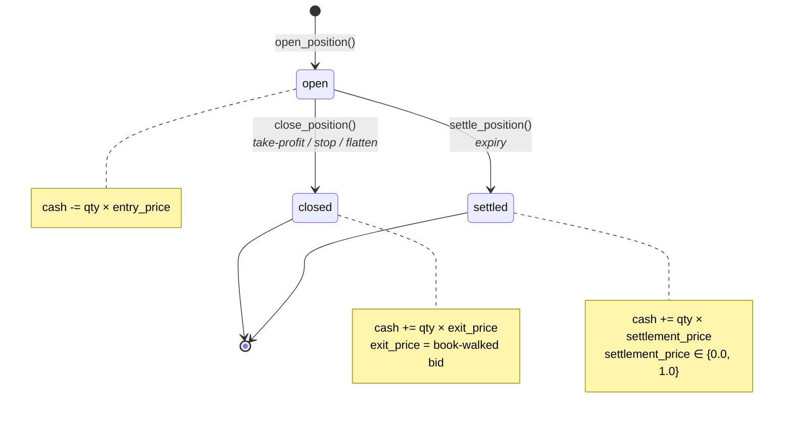

### P&L

Because payout is 1.0 and commission is 0:

```
pnl = (exit_price − entry_price) × qty − fees
```

| Scenario | Entry | Exit | qty | P&L |
|---|---:|---:|---:|---:|
| Wing hits take-profit | 0.1500 | 0.5000 | 100 | **+35.00** |
| Wing expires worthless | 0.1500 | 0.0000 | 100 | **−15.00** |
| Wing settles ITM | 0.1500 | 1.0000 | 100 | **+85.00** |

A strangle costs ~0.30 per pair; one wing reaching 0.50 covers both and leaves profit.

### Write path

Every state change writes to **both** sinks:

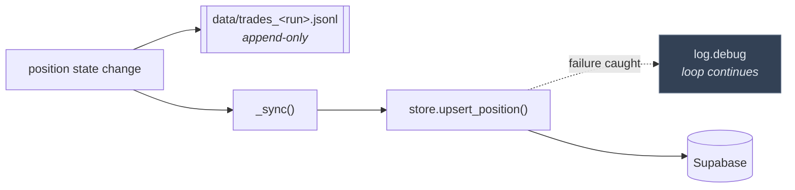

The JSONL ledger is the fallback book of record. **A Supabase outage never stops
a run.**

---

## 9. `store.py` — Supabase persistence

Talks to PostgREST directly with `requests` — one HTTP dependency, no client-library
version drift.

| Method | Table | Verb |
|---|---|---|
| `start_run()` | `runs` | INSERT, returns id |
| `upsert_position()` | `positions` | UPSERT on `(run_id, position_id)` |
| `log_event()` | `events` | INSERT |
| `snapshot()` | `market_snapshots` | INSERT |
| `heartbeat()` | `runs` | PATCH `last_heartbeat`, `cash` |
| `finish_run()` | `runs` | PATCH `status` |

### Failure policy

```python
def _note_failure(self, msg):
    self._failures += 1
    if self._failures <= 3 or self._failures % 50 == 0:
        log.warning(...)
```

Warns on the first three failures, then every fiftieth — a long outage cannot flood
the log. Writes are `threading.Lock`-guarded.

`build_store()` returns a **`NullStore`** (no-op, same interface) when
`SUPABASE_URL` / `SUPABASE_SERVICE_KEY` are unset, so the worker runs local-only
with no branching at call sites.

---

## 10. `engine.py` — poll loop

### `poll_once()` — strict ordering

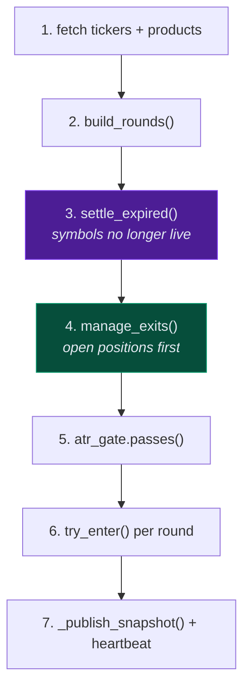

The order matters: **settle and exit before entering**, so capital and
`max_concurrent_rounds` are freed before new entries are considered.

### `try_enter()` — all-or-nothing legs

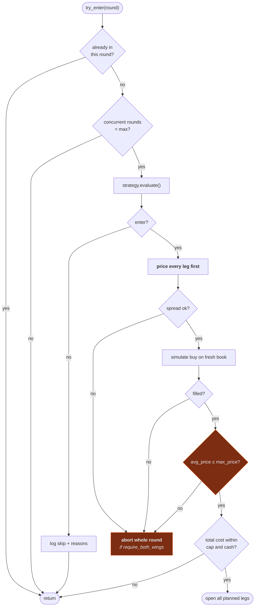

Two details that matter:

1. **Legs are priced before any is opened.** With `require_both_wings`, a leg that
   cannot fill must not leave the other one on naked.
2. **`avg_price` is re-tested against `max_price`.** The touch price passing the
   odds rule is not enough — slippage can break the threshold, and that round is
   then skipped with reason `"slippage broke odds: avg 0.1802 > max 0.1667"`.

### Snapshot payload

`_publish_snapshot()` re-runs `strategy.evaluate()` per live round purely to
populate `would_enter` and `reasons` for the dashboard, so the UI shows the engine's
*actual* reasoning rather than a reimplementation of it.

---

## 11. `report.py` — statistics

| Metric | Definition |
|---|---|
| `leg_win_rate_pct` | Winning legs / all closed legs |
| **`round_win_rate_pct`** | Rounds with positive **summed** P&L / all rounds |
| `return_on_cost_pct` | `total_pnl / total_cost` |
| `entry_slippage_cost` | `Σ entry_slippage × qty` |
| `max_drawdown` | Peak-to-trough on the round-ordered equity curve |
| `by_role` | P&L, win rate, avg entry per `wing_low` / `wing_high` / `middle` |

> **Leg-level and round-level are reported separately and deliberately.** On a
> strangle one wing is designed to expire worthless. An actual verification run
> produced **33.3% leg win rate** but **50.0% round win rate** — judging on legs
> would badly misread the strategy.

`web/src/lib/stats.js` mirrors this module so the dashboard and CLI cannot disagree.

---

## 12. Database schema

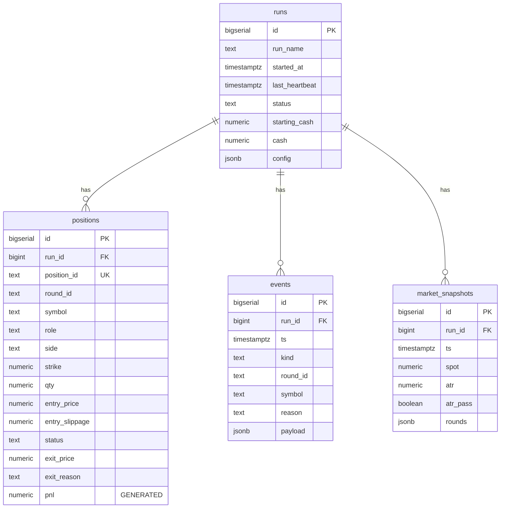

### Generated P&L column

```sql
pnl numeric generated always as (
  case when exit_price is null then null
       else (exit_price - entry_price) * qty - fees end
) stored
```

P&L is computed by the database, so it cannot drift from the stored prices.

### Indexes

| Index | Serves |
|---|---|
| `positions (run_id, status)` | Open-position lookup |
| `positions (entry_time desc)` | History table ordering |
| `positions (run_id, round_id)` | Round-level aggregation |
| `events (run_id, ts desc)` | Activity feed |
| `snapshots (run_id, ts desc)` | "Latest snapshot" query |

### Snapshot pruning

A snapshot is written every poll (~2s) — roughly 43k rows/day. An `AFTER INSERT`
trigger deletes rows older than 24h:

```sql
create trigger prune_snapshots
  after insert on public.market_snapshots
  for each row execute function public.prune_market_snapshots();
```

### Security

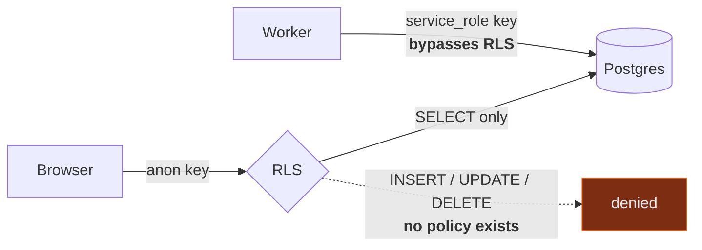

RLS is enabled on all four tables with **`SELECT`-only policies**. No write policy
exists, so the anon key cannot mutate anything even though it ships in the client
bundle.

---

## 13. Frontend

### Component tree

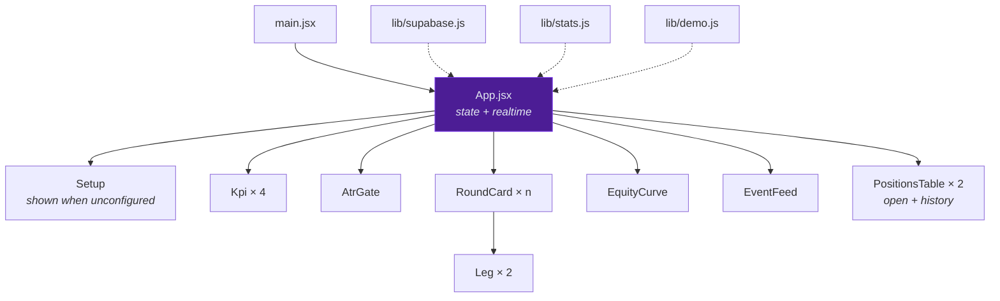

### Data flow

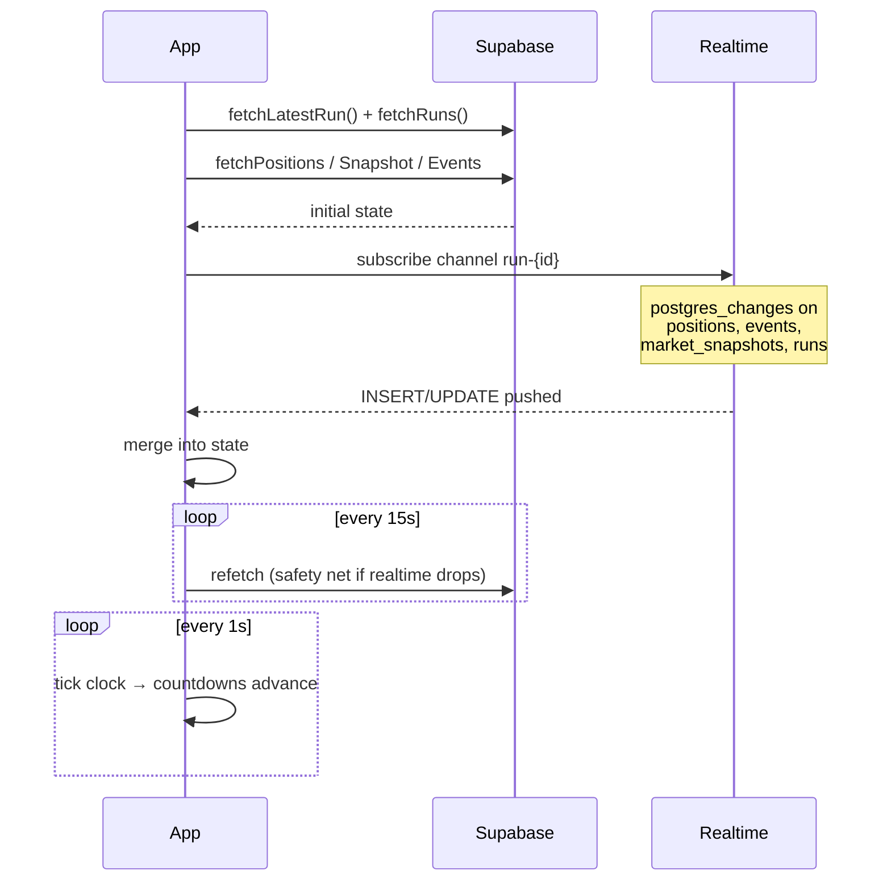

Snapshot countdowns are recomputed against snapshot age, so `08:34 left` keeps
counting down between 2-second snapshots instead of freezing.

### Responsive strategy

| Breakpoint | KPIs | Rounds | Tables |
|---|---|---|---|
| `< 640px` | 2 cols | stacked | **stacked cards** |
| `640–1024px` | 2 cols | stacked | cards |
| `≥ 1024px` | 4 cols | 1 col | table |
| `≥ 1280px` | 4 cols | 2 cols | table |

`PositionsTable` renders a real `<table>` on `md+` and a card list below it — a
10-column table is unreadable on a phone, and this dashboard is meant to be
glanceable on one.

### Demo mode

`?demo=1` loads `lib/demo.js` and short-circuits every Supabase effect, so the UI
can be reviewed before a project exists.

---

## 14. Configuration reference

<details>
<summary><b>api</b></summary>

| Key | Default | Notes |
|---|---|---|
| `base_url` | `https://api.delta.exchange` | **Global host** — binaries absent from India host |
| `underlying` | `BTC` | `BTC` or `ETH` |
| `poll_interval_sec` | `2.0` | |
| `request_timeout_sec` | `10.0` | |
| `max_retries` | `3` | |
</details>

<details>
<summary><b>atr</b> — "only when BTC ATR > 200"</summary>

| Key | Default | Notes |
|---|---|---|
| `candle_symbol` | `BTCUSDT` | ⚠️ **never `BTCUSD`** — stale, ATR = 0 |
| `resolution` | `5m` | |
| `period` | `14` | Wilder |
| `min_atr` | `200.0` | The gate |
| `refresh_sec` | `30.0` | Cache TTL |
| `enabled` | `true` | |
</details>

<details>
<summary><b>timing</b> — "give a filter for timings"</summary>

| Key | Default | Notes |
|---|---|---|
| `min_seconds_since_launch` | `30.0` | Let the book settle |
| `max_seconds_since_launch` | `900.0` | |
| `min_seconds_to_expiry` | `180.0` | No entries in the last 3 min |
| `max_seconds_to_expiry` | `1800.0` | |
| `sessions` | `[]` | `["13:00-21:00"]`; empty = all hours |
| `session_timezone` | `IST` | `UTC` or `IST` |
| `weekdays` | `[0..6]` | 0 = Monday |
</details>

<details>
<summary><b>entry</b> — odds rules</summary>

| Key | Default | Notes |
|---|---|---|
| `odds_convention` | `risk_reward` | **Ambiguous** — vs `payout_multiple` |
| `wing_odds` | `5.0` | → max 0.1667 |
| `middle_odds` | `3.0` | → max 0.2500 |
| `trade_wings` | `true` | |
| `require_both_wings` | `true` | All-or-nothing |
| `trade_middle` | `false` | Off until wings are baselined |
| `middle_side` | `auto` | `auto` picks the cheaper |
| `size_contracts` | `100` | **Dominant slippage driver** |
| `one_entry_per_round` | `true` | |
</details>

<details>
<summary><b>exit</b> — "exit rule ITM 50"</summary>

| Key | Default | Notes |
|---|---|---|
| `mode` | `price` | **Ambiguous** — vs `spot_points` |
| `take_profit_price` | `0.50` | |
| `spot_points_itm` | `50.0` | Used only in `spot_points` mode |
| `stop_loss_price` | `null` | e.g. `0.02` to cut a dead wing |
| `flatten_before_expiry_sec` | `null` | e.g. `30` to never carry into settlement |
</details>

<details>
<summary><b>fills</b> — "be careful about slippages"</summary>

| Key | Default | Notes |
|---|---|---|
| `model` | `orderbook` | `best_quote` / `mark` are diagnostic only |
| `extra_slippage_ticks` | `0.0` | Adverse padding beyond visible depth |
| `max_book_levels` | `20` | |
| `allow_partial` | `false` | Reject rather than under-fill |
| `refetch_book_on_execute` | `true` | Puts real latency in the fill |
| `max_spread_frac` | `1.5` | Skip if spread > 150% of mid |
</details>

<details>
<summary><b>portfolio</b></summary>

| Key | Default | Notes |
|---|---|---|
| `starting_cash` | `10000.0` | USDT |
| `max_concurrent_rounds` | `2` | Matches ~2 live rounds |
| `max_cost_per_round` | `null` | |
| `taker_fee_rate` | `0.0` | Venue reports 0 for binaries |
</details>

`Config.from_dict()` **rejects unknown keys**, so a typo in `config.yaml` fails
loudly at startup instead of silently ignoring a rule.

---

## 15. Error handling

| Failure | Handling | Trading continues? |
|---|---|---|
| Delta 429 | Sleep `Retry-After`, retry | ✅ |
| Delta 5xx / timeout | Exponential backoff ×3 | ✅ |
| Candle fetch fails | Return **cached** ATR | ✅ |
| Order book unavailable | Leg skipped, reason logged | ✅ |
| Insufficient depth | Fill rejected (`allow_partial: false`) | ✅ |
| Supabase down | `_note_failure`, JSONL continues | ✅ |
| Settlement not yet published | Retried next poll | ✅ |
| Unhandled error in `poll_once` | Caught in `run()`, logged with traceback | ✅ |
| `KeyboardInterrupt` | `finish_run()` in `finally` | Clean stop |

The design principle: **a data problem must never become a position problem.**
Anything the worker cannot verify results in *not trading*, never in a guess.

---

## 16. Extension points

| To add | Touch | Notes |
|---|---|---|
| ETH trading | `config.yaml` → `api.underlying: ETH` | Already supported; strikes spaced 5 |
| A new exit rule | `Strategy.should_exit` + `ExitConfig` | Add a `mode` branch |
| A new fill model | `FillEngine.simulate` + `FillConfig.model` | Add a branch |
| Position rehydration on restart | `Portfolio.__init__` | Query `positions where status='open'` |
| Parameter sweep | Multiple `run_name`s | Dashboard's run selector already switches between them |
| Alerting | `Portfolio.log_event` | Single chokepoint for all events |
| WebSocket feed | `DeltaClient` | Keep the same interface; `engine` is agnostic |

### Testing without network

`rounds`, `fills`, `strategy`, `report` and `config` are pure. A `Fill` can be
asserted directly against a synthetic book:

```python
book = {"sell": [{"price": "0.03", "size": 30},
                 {"price": "0.05", "size": 70}]}
fill = walk_book(book, "buy", 100, max_levels=20, allow_partial=False)
assert fill.avg_price == pytest.approx(0.044)   # (30×0.03 + 70×0.05) / 100
assert fill.levels_consumed == 2
```

> No test suite ships yet. The pure-module boundary is deliberate so one can be
> added without refactoring.
